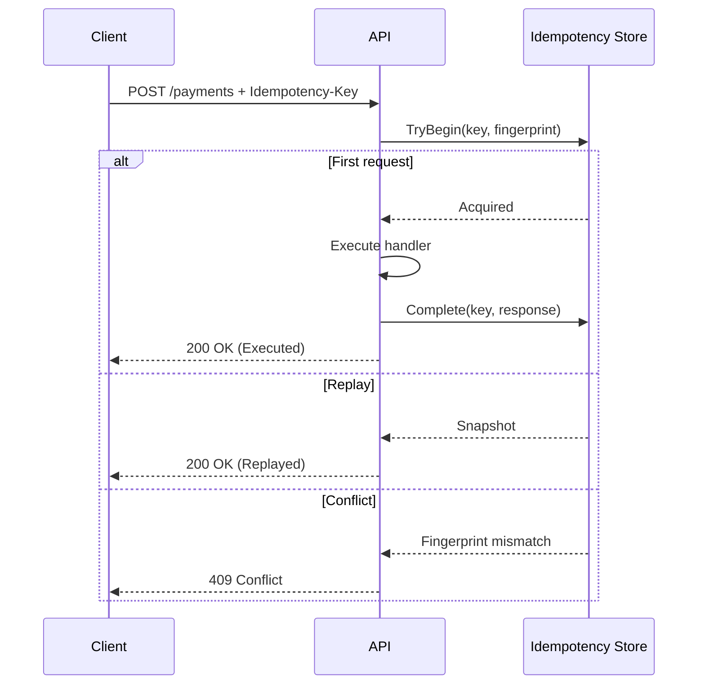
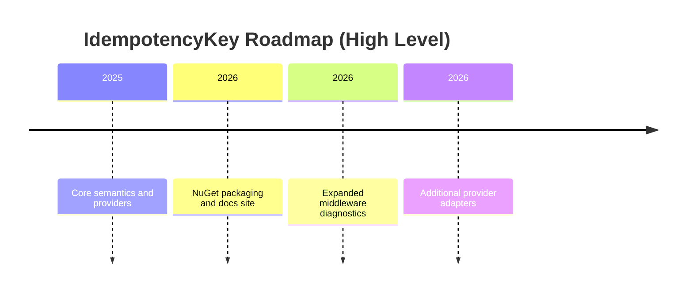

# IdempotencyKey.AspNetCore

<div align="center">

**Idempotency for ASP.NET Core, designed for reliability, clarity, and AOT performance.**

[](LICENSE)
[](global.json)
[](README.md)

</div>

> A robust, AOT-friendly library that adds Stripe-like idempotency semantics to ASP.NET Core endpoints. It ensures that retrying a request with the same `Idempotency-Key` results in the same response, while rejecting reuse of the key for different requests.

---

## Contents

- [IdempotencyKey.AspNetCore](#idempotencykeyaspnetcore)
  - [Contents](#contents)
  - [Why IdempotencyKey](#why-idempotencykey)
  - [Features](#features)
  - [Quick Start](#quick-start)
  - [Usage Patterns](#usage-patterns)
    - [1. Minimal API (Group)](#1-minimal-api-group)
    - [2. Controllers (Attribute)](#2-controllers-attribute)
    - [3. Custom Error Model](#3-custom-error-model)
  - [Concepts](#concepts)
    - [Idempotency Key](#idempotency-key)
    - [Fingerprint \& Conflict](#fingerprint--conflict)
    - [In-Flight Requests](#in-flight-requests)
  - [Storage Providers](#storage-providers)
    - [Memory](#memory)
    - [Redis](#redis)
    - [Postgres](#postgres)
  - [Benchmarks](#benchmarks)
  - [Performance Notes](#performance-notes)
  - [How to Test](#how-to-test)
    - [PowerShell](#powershell)
    - [cURL](#curl)
  - [Roadmap](#roadmap)
  - [Community](#community)
  - [License](#license)

---

## Why IdempotencyKey

APIs that charge money, create records, or trigger side effects must be safe to retry. This library provides a deterministic, Stripe-like idempotency layer for ASP.NET Core to prevent duplicate work and preserve correctness even under client retries, timeouts, or network failures.



---

## Features

- **Stripe-like Semantics**:
  - **Replay**: Same Key + Same Request Fingerprint -> Returns stored response (status + headers + body).
  - **Conflict**: Same Key + Different Request Fingerprint -> Returns `409 Conflict`.
  - **In-Flight Handling**: Concurrent requests with same key wait for the first one to complete (or return 409/429 based on config).
- **Native AOT Compatible**: Designed for Minimal APIs and uses `System.Text.Json` source generation.
- **Storage Agnostic**: Providers for Memory, Redis, and Postgres.
- **Flexible Integration**: Supports Minimal APIs (Filter) and Controllers (Attribute/Middleware).

---

## Quick Start

**Installation**

Install the ASP.NET Core integration package:

```bash
dotnet add package IdempotencyKey.AspNetCore
```

Then install one storage provider:

```bash
# In-memory (dev/test)
dotnet add package IdempotencyKey.Store.Memory

# Redis
dotnet add package IdempotencyKey.Store.Redis

# Postgres
dotnet add package IdempotencyKey.Store.Postgres
```

**Minimal API (Per-Endpoint)**

The most granular way to use idempotency is via the `.RequireIdempotency()` extension method on Minimal API endpoints.

**Important:** If your endpoint uses Model Binding (e.g. `[FromBody]`, or typed arguments like `MyRequest req`), you **MUST** enable buffering middleware globally to allow the idempotency filter to read the body.

```csharp
var builder = WebApplication.CreateSlimBuilder(args);
builder.Services.AddIdempotencyKey(); // Registers services
builder.Services.AddSingleton<IIdempotencyStore, MemoryIdempotencyStore>(); // Choose a store

var app = builder.Build();

// REQUIRED if using Model Binding (e.g., Post/Put with body)
app.UseIdempotencyKey();

app.MapPost("/payments", (PaymentRequest req) =>
{
    // Process payment...
    return Results.Ok(new { Status = "Processed", Id = Guid.NewGuid() });
})
.RequireIdempotency(options =>
{
    options.Ttl = TimeSpan.FromMinutes(60);
});

app.Run();
```

---

## Usage Patterns

### 1. Minimal API (Group)

You can apply idempotency to an entire route group.

```csharp
var payments = app.MapGroup("/payments")
    .RequireIdempotency(); // Applies to all endpoints in group

payments.MapPost("/", ...); // Idempotent
payments.MapPost("/{id}/refund", ...); // Idempotent
```

### 2. Controllers (Attribute)

For MVC Controllers, use the `[RequireIdempotency]` attribute. You must also register the middleware.

```csharp
// Program.cs
builder.Services.AddControllers();
builder.Services.AddIdempotencyKey();
// ... register store ...

var app = builder.Build();
app.UseRouting();

// REQUIRED: Middleware handles the attribute logic
app.UseIdempotencyKey();

app.MapControllers();
app.Run();
```

```csharp
// PaymentsController.cs
[ApiController]
[Route("[controller]")]
public class PaymentsController : ControllerBase
{
    [HttpPost]
    [RequireIdempotency(TtlSeconds = 60)]
    public IActionResult Create([FromBody] PaymentRequest request)
    {
        return Ok(new { Status = "Processed" });
    }
}
```

### 3. Custom Error Model

If your service has a standard error contract, you can override idempotency error responses globally.

```csharp
builder.Services.AddIdempotencyKey(options =>
{
  options.ErrorResponseWriter = async (httpContext, error) =>
  {
    var correlationId = httpContext.TraceIdentifier;

    switch (error.Kind)
    {
      case IdempotencyErrorKind.Validation:
        httpContext.Response.StatusCode = StatusCodes.Status422UnprocessableEntity;
        await httpContext.Response.WriteAsJsonAsync(new
        {
          code = "VALIDATION_ERROR",
          message = error.Message,
          correlationId
        });
        break;

      case IdempotencyErrorKind.Conflict:
        httpContext.Response.StatusCode = StatusCodes.Status409Conflict;
        await httpContext.Response.WriteAsJsonAsync(new
        {
          code = "IDEMPOTENCY_CONFLICT",
          message = "Request conflicts with a previous use of this key.",
          reason = error.ConflictReason,
          correlationId
        });
        break;

      case IdempotencyErrorKind.InFlight:
        httpContext.Response.StatusCode = StatusCodes.Status409Conflict;
        if (error.RetryAfterSeconds.HasValue)
        {
          httpContext.Response.Headers["Retry-After"] = ((int)error.RetryAfterSeconds.Value).ToString();
        }

        await httpContext.Response.WriteAsJsonAsync(new
        {
          code = "IDEMPOTENCY_IN_FLIGHT",
          message = error.Message,
          retryAfterSeconds = error.RetryAfterSeconds,
          correlationId
        });
        break;

      case IdempotencyErrorKind.InFlightTimeout:
        httpContext.Response.StatusCode = StatusCodes.Status408RequestTimeout;
        if (error.RetryAfterSeconds.HasValue)
        {
          httpContext.Response.Headers["Retry-After"] = ((int)error.RetryAfterSeconds.Value).ToString();
        }

        await httpContext.Response.WriteAsJsonAsync(new
        {
          code = "IDEMPOTENCY_IN_FLIGHT_TIMEOUT",
          message = "Timed out while waiting for the original request.",
          retryAfterSeconds = error.RetryAfterSeconds,
          correlationId
        });
        break;

      default:
        httpContext.Response.StatusCode = error.StatusCode;
        await httpContext.Response.WriteAsJsonAsync(new
        {
          code = "IDEMPOTENCY_ERROR",
          message = error.Message,
          correlationId
        });
        break;
    }
  };
});
```

`error.Kind` values:

- `Validation`
- `Conflict`
- `InFlight`
- `InFlightTimeout`

Notes:

- You can keep default status codes with `httpContext.Response.StatusCode = error.StatusCode`.
- You can remap any error kind to your own contract and status code policy.
- `Retry-After` is not automatic in custom mode; set it yourself when needed.

---

## Concepts

### Idempotency Key

Clients must send a unique key in the `Idempotency-Key` header (configurable). If the header is missing on a required endpoint, the server returns `400 Bad Request`.
Keys are validated using RFC3986 unreserved characters (`A-Z`, `a-z`, `0-9`, `-`, `.`, `_`, `~`) with a default max length of **256**.

### Fingerprint & Conflict

The library computes a SHA-256 fingerprint of the request including:

- HTTP Method
- Route Template
- Request Body (raw bytes)
- Selected Headers (configurable)

If a client sends the same Key but a **different** body/fingerprint, the server returns `409 Conflict`. This prevents accidental misuse of keys.
For replay safety, only a safe allowlist of response headers is cached and replayed.

### In-Flight Requests

If two requests with the same key arrive concurrently:

1. The first acquires the lock (In-Flight).
2. The second waits (default 10s) for the first to complete.
   - If first completes: Second gets the replayed response.
   - If timeout: Second gets `409 Conflict` (or `429` / `Retry-After` depending on config).

---

## Storage Providers

### Memory

Good for testing/dev.

```csharp
builder.Services.AddSingleton<IIdempotencyStore, MemoryIdempotencyStore>();
```

### Redis

Production-grade distributed store.

```csharp
builder.Services.AddSingleton<IIdempotencyStore>(sp =>
    new RedisIdempotencyStore(new RedisIdempotencyStoreOptions { Configuration = "localhost:6379" }));
```

### Postgres

Transactional storage using `INSERT ... ON CONFLICT`.

```csharp
builder.Services.AddSingleton<IIdempotencyStore>(sp =>
    new PostgresIdempotencyStore(new PostgresIdempotencyStoreOptions { ConnectionString = "..." }));
```

For long-running production workloads, schedule periodic cleanup of expired rows:

```sql
DELETE FROM public.idempotency_records WHERE expires_at_utc < now();
```

---

## Benchmarks

The solution includes a BenchmarkDotNet project to measure performance of core components.

**Running Benchmarks**

```bash
dotnet run -c Release --project benchmarks/IdempotencyKey.Benchmarks
```

This will run benchmarks for:

- **Fingerprinting**: Hashing request bodies of various sizes (1KB, 16KB, 256KB) and computing the full request fingerprint.
- **Store Operations**: Performance of `TryBeginAsync` (Acquire/Replay) and `CompleteAsync` using the `MemoryIdempotencyStore`.

**Concurrency Smoke Test**

To verify concurrency correctness (ensure exactly-once execution under load), run the lightweight smoke test:

```bash
dotnet run -c Release --project benchmarks/IdempotencyKey.Benchmarks -- smoke
```

This fires 100 parallel requests with the same key and asserts that only one is executed.

---

## Performance Notes

- **Max Snapshot Size**: The library limits the size of the response body stored in the snapshot to avoid bloating the storage provider. The default is **256 KB**. Responses larger than this will result in an error (or truncated/placeholder behavior depending on configuration).
- **Body Hashing**: The default hasher computes SHA-256 over the entire request body to ensure collision resistance and enforces a configurable max request body size for hashing. The default is **1 MB**.

---

## How to Test

You can verify the behavior using PowerShell or curl.

### PowerShell

```powershell
$headers = @{ 'Idempotency-Key' = 'test-key-1' }
$body = '{ "amount": 100, "currency": "USD" }'

# First Request -> 200 OK (Executed)
Invoke-RestMethod -Method Post -Uri https://localhost:7146/payments -Headers $headers -ContentType 'application/json' -Body $body

# Second Request (Same Body) -> 200 OK (Replayed, same result)
Invoke-RestMethod -Method Post -Uri https://localhost:7146/payments -Headers $headers -ContentType 'application/json' -Body $body

# Third Request (Different Body) -> 409 Conflict
$body2 = '{ "amount": 200, "currency": "USD" }'
try {
    Invoke-RestMethod -Method Post -Uri https://localhost:7146/payments -Headers $headers -ContentType 'application/json' -Body $body2
} catch {
    Write-Host "Conflict: $($_.Exception.Response.StatusCode)"
}
```

### cURL

```bash
# 1. First Request
curl -v -X POST https://localhost:7146/payments \
  -H "Idempotency-Key: key1" \
  -H "Content-Type: application/json" \
  -d '{"amount": 10}'

# 2. Replay (Same Key, Same Body) -> Should return 200 OK (Cached)
curl -v -X POST https://localhost:7146/payments \
  -H "Idempotency-Key: key1" \
  -H "Content-Type: application/json" \
  -d '{"amount": 10}'

# 3. Conflict (Same Key, Different Body) -> Should return 409 Conflict
curl -v -X POST https://localhost:7146/payments \
  -H "Idempotency-Key: key1" \
  -H "Content-Type: application/json" \
  -d '{"amount": 20}'
```

---

## Roadmap



---

## Community

This project is open source and community-driven. Your help makes it better.

- **Contributions**: Issues and pull requests are welcome. If you plan to work on something sizable, open an issue first so we can align on the approach.
- **Code Quality**: Keep changes focused, add tests where relevant, and follow the existing style.
- **Respectful Collaboration**: Be kind and constructive. Harassment, trolling, or abusive behavior is not tolerated.

If you are looking for a place to start, check the issue tracker for labels like "good first issue" or "help wanted".

---

## License

MIT. See [LICENSE](LICENSE).
